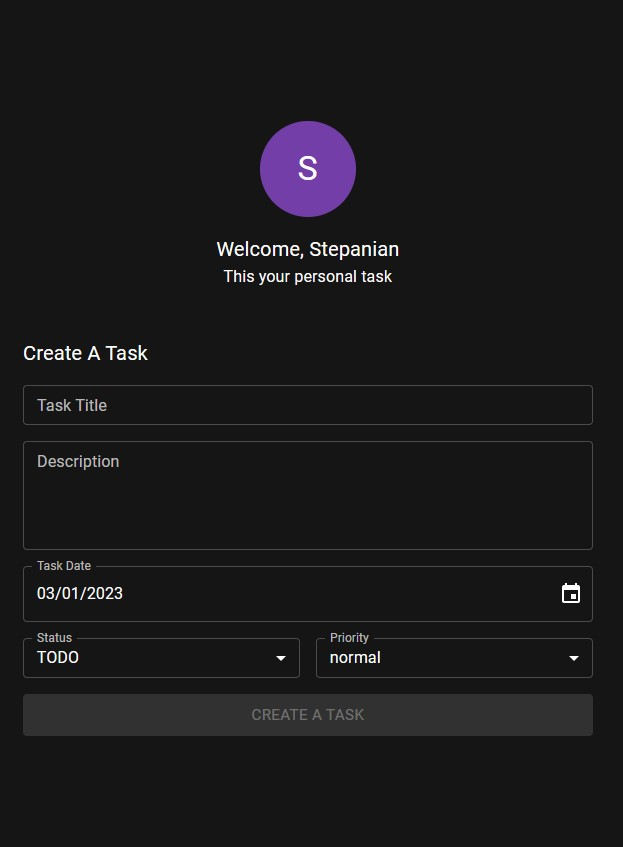
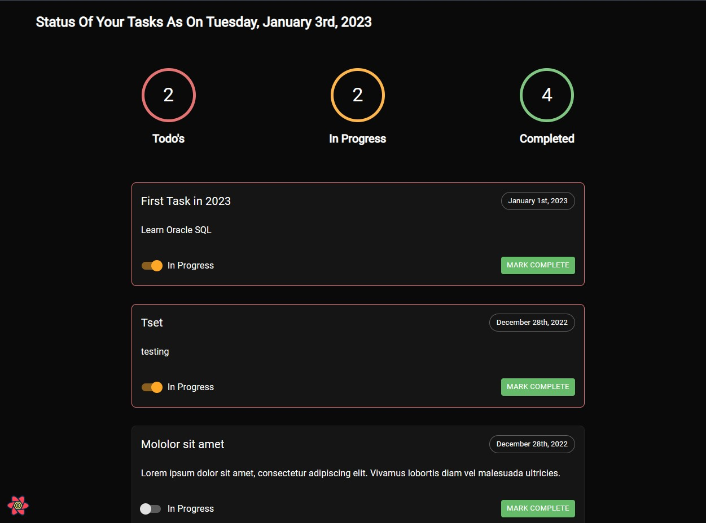
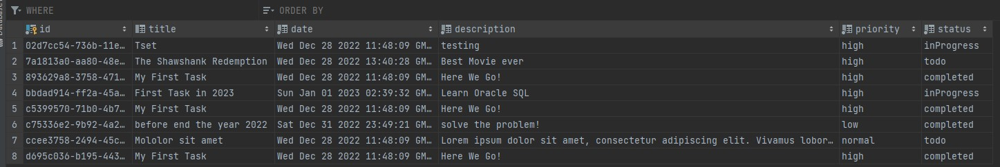

## Full Stack TODO App

## Documentation

[Documentation](https://www.typescriptlang.org/)

## Features

- React Typescript
- Node JS
- MySQL-DataGrip
- TanStack V4
- MUI
- context api
- prop types
- typescript eslint
- date fns

## API Reference

#### fetch all tasks

```http
  GET http://localhost:3200/tasks
```

#### create a new task

```http
  POST http://localhost:3200/tasks
```

#### update a task

```http
  PUT http://localhost:3200/tasks
```

## Color Primary

| Color | rgba                 |
| ----- | -------------------- |
| light | rgba(168,85,247,.80) |
| main  | rgba(168,85,247,.65) |
| dark  | rgba(168,85,247,.28) |
| light | rgba(168,85,247,.80) |

## Color Background

| Color | Hex             |
| ----- | --------------- |
| paper | #151515         |
| main  | rgba(0,0,0,.96) |

## Screenshots







## Run Locally

Clone the project

```bash
  git clone https://link-to-project
```

Go to the project directory

```bash
  cd my-project
```

Install dependencies

```bash
  npm install
```

Start the server

```bash
  npm start
```

## Environment Variables

To run this project, you will need to add the following environment variables to your .env file

`PORT=3200`

`MYSQL_USER=root`

`MYSQL_PASSWORD='your database pass'`

`MYSQL_DB=todo`

## License

[MIT](https://choosealicense.com/licenses/mit/)
